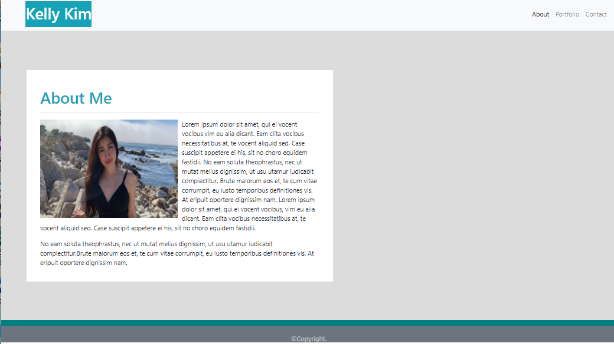
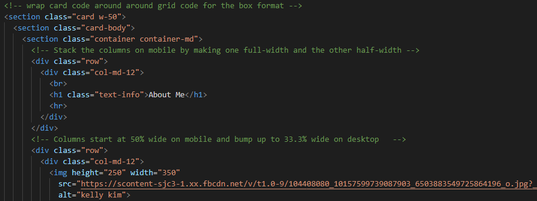

# Responsive_Portfolio

Building the responsive portfolio project was challenging. Using Bootstrap, I did my best to create a responsive design which ensures that web applications render well on a variety of devices and window or screen sizes. The responsive portfolio is our very own personalized website. Each section on the site will help the audience get to know a little bit more about me. The about me page features a summary about my life and my interests. The portfolio section gives a quick view of the projects that I have completed by the end of this course. Lastly, the contact page provides a section for anyone interested in my work to contact me by leaving a message. I'm excited for this site to express the skills that I hold and to feature all of my work by the end of this program.

## Process
Getting started on my responsive portfolio was a fun challenge! I feel satisfied on how each section came out. Below is a little snippet of my about me:

Creating a code for the about me was an arduous task. I was debating if I should combine a card with a grid to create that specific layout, but in the end after trial and error it came out alright. I took a piece of a code from a card component and wrapped it around the grid code to create the white box. Here's how it turned out:

### Installing/Technology Used

The following platforms were required to build this website:

1) VS code
2) GitBash/Terminal
3) GitLab
4) GitHub

## Built With

* [HTML](https://developer.mozilla.org/en-US/docs/Web/HTML)
* [CSS](https://developer.mozilla.org/en-US/docs/Web/CSS)
* [Bootstrap](https://getbootstrap.com/docs/4.5/getting-started/introduction/)

## Deployed Link

* [See Live Site](https://kellykim831.github.io/Responsive_Portfolio/)

## Authors

* **Kelly Kim** 

- [Link to Portfolio Site](https://kellykim831.github.io/Responsive_Portfolio/)
- [Link to Github](https://github.com/kellykim831)
- [Link to LinkedIn](https://www.linkedin.com/in/realtorkellykim/)
- [Link to Facebook](https://www.facebook.com/kimkelz)

See also the list of [contributors](https://github.com/your/project/contributors) who participated in this project.

## Acknowledgments

- [Link to Google](https://www.google.com)
