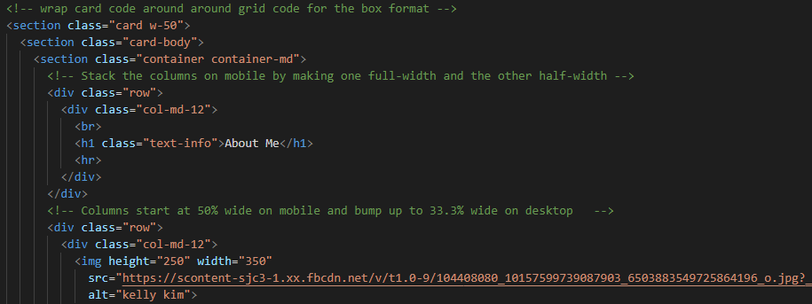

# Updated Responsive_Portfolio

The responsive portfolio was an interesting and challenging project to create a responsive design that renders well on a variety of devices and window or screen sizes. Using Bootstrap's amazing components, I did my best to create my responsive portfolio site. 
Each section on the site will help the audience get to know a little bit more about me. The about me page features a summary about my life and my interests. The portfolio section will give a quick view of the projects that I will have completed by the end of this course. Lastly, the contact page provides a section for anyone interested in my work to contact me by leaving a message. I'm excited for this site to showcase all of my work by the end of this program.

## Process
Getting started on my responsive portfolio was a great way for me to practice building a website! I feel satisfied on how each section came out. Below is a gif of how my updated portfolio looks like:

Creating a code for the about me section was an arduous task. I was debating if I should combine a card code along with a grid system to create a specific layout, but in the end after trial and error the combination of the codes came out alright. I took a piece of a code from a card component and wrapped it around the grid code to create the white box pictured above. 

### Installing/Technology Used

The following platforms were required to build this website:

1) VS code
2) GitBash/Terminal
3) GitLab
4) GitHub

## Built With

* [HTML](https://developer.mozilla.org/en-US/docs/Web/HTML)
* [CSS](https://developer.mozilla.org/en-US/docs/Web/CSS)
* [Bootstrap](https://getbootstrap.com/docs/4.5/getting-started/introduction/)

## Deployed Heroku Link

* [See Live Site](https://kellykim-portfolio.herokuapp.com/)

## Authors

* **Kelly Kim** 

- [Link to Portfolio Site](https://kellykim831.github.io/Responsive_Portfolio/)
- [Link to Github](https://github.com/kellykim831)
- [Link to LinkedIn](https://www.linkedin.com/in/realtorkellykim/)
- [Link to Facebook](https://www.facebook.com/kimkelz)

See also the list of [contributors](https://github.com/your/project/contributors) who participated in this project.

## Acknowledgments

- [Link to Google](https://www.google.com)
- [Link to W3 Schools](https://www.w3schools.com)
